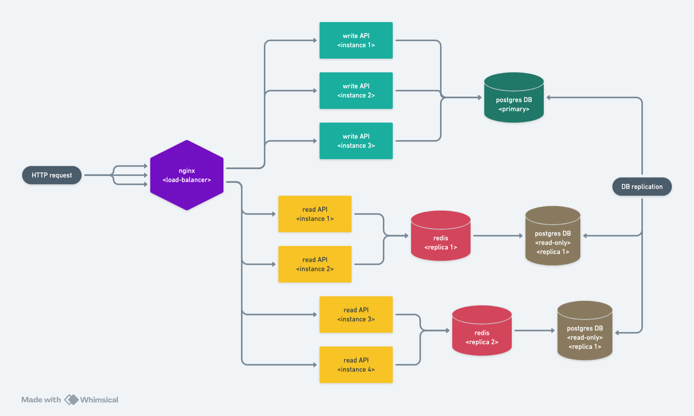
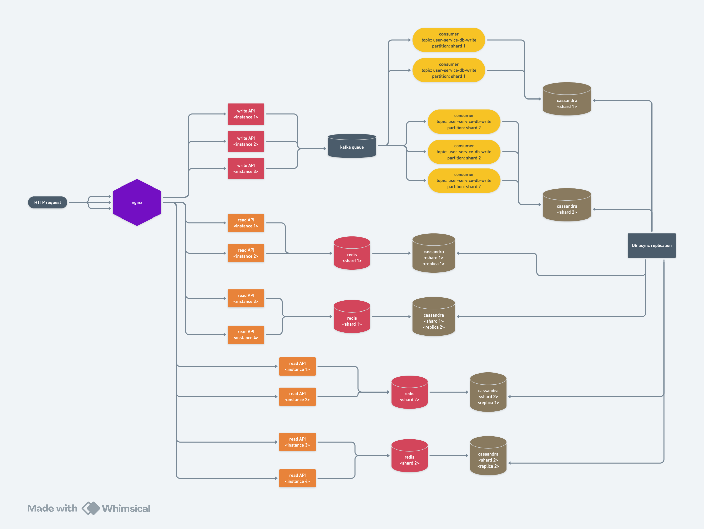

## Simple Service Design



## Complex Service Design



## 1. Understand the Problem

Start by asking questions until you can clearly define the core functionality.

### Functional API Endpoints (character-only style)

```api
POST   /login                    - Authenticates a user  
POST   /tweets                   - Creates a new tweet  
GET    /tweets/feed              - Returns personalized feed  
GET    /tweets/:user_id          - Lists all tweets by a user  
POST   /follow/:user_id          - Follows a user  
DELETE /unfollow/:user_id        - Unfollows a user  
GET    /followers                - Lists my followers  
GET    /subscriptions            - Lists who I follow  
GET    /notifications            - Fetches user notifications  
```

### Define the Core Data Model

```
+--------+       +----------+       +--------------+
|  User  |<----->| Tweet    |       | Subscription |
+--------+       +----------+       +--------------+
| id     |       | id       |       | id           |
| name   |       | user_id  |<----+ | subscriber_id|
| email  |       | content  |       | subscribed_to|
+--------+       | timestamp|       +--------------+
                 +----------+      
```

## 2. Estimate Scale and Performance Needs

### Volume & Usage Patterns

- **Initial user base**: 10,000 users  
- **Daily active users**: 3,000  
- **Posts per day**: ~15,000 (avg 5 per user)  
- **Reads per day**: ~300,000 (feed browsing, tweet reads)  
- **Write-to-read ratio**: ~1:20

### Resource Estimates

- **Avg tweet size**: ~300 bytes  
- **Tweet storage/day**: ~4.5 MB/day (15k * 300B)  
- **Yearly tweet storage**: ~1.6 GB  
- **Follower edges**: ~3M (assuming avg 300 followers/user)  
- **Subscriptions/day**: ~5K follows/unfollows  

### Constraints & Dependencies

- Protocol: HTTP/REST (public API), gRPC (internal services)  
- Format: JSON for external, Protobuf internally  
- Authentication: OAuth2 or token-based  
- Metrics: Prometheus + Grafana  
- Logging: Cloud-native (e.g., CloudWatch, ELK)

## 4. Map Requirements to System Constraints

- **Per Tweet Cost**:
  - 300 bytes storage
  - 1 DB write (tweets)
  - 1–2 cache invalidations
- **Total Data**: If each user posts 5 tweets/day, yearly:
  - 5 * 365 * 300B * 10K users ≈ ~5.5 GB of tweet data/year
- **Follower Graph**:
  - If each user has 300 followers, 10K users → ~3M edges

## 5. Create a High-Level Architecture

Design an architecture to meet functional and scale goals.

### Components:
- Frontend (Web/Mobile)
- API Gateway
- Auth Service
- User Service
- Tweet Service
- Feed Service
- Subscription Service
- Notification Service
- PostgreSQL (User/Tweet/Subscription DBs)
- Redis (Feed cache)
- Kafka (Event propagation)
- Object Storage (for media, if added)

### Character-Based Service Interaction Diagram

```arch
+-------------+     +-------------+     +------------------+
|   Client    | --> | API Gateway | --> | Auth Service     |
+-------------+     +-------------+     +------------------+
                                       |
                                       v
+-------------+     +--------------+     +-------------------+
| User Svc    | <--> | Tweet Svc   | <--> | Subscription Svc  |
+-------------+     +--------------+     +-------------------+
                         |
                         v
                 +----------------+
                 |  Feed Service  |
                 +----------------+
                         |
                         v
                  +--------------+
                  | Redis Cache  |
                  +--------------+

                (async events → Kafka → Notification Svc)
```

---

### ✅ Checklist

**Scalability**
- Use Redis + Fanout-on-Write for feed generation  
- Apply sharding on high-volume tables (e.g., tweets, subscriptions)

**Reliability**
- Redundant DBs with read replicas  
- Retry logic + DLQs for async services  
- Health checks and circuit breakers

**Performance**
- Cache hot feeds and user profiles  
- Use pagination + indexing for queries  
- Async processing for fanouts and notifications

**Cost**
- Small scale: ~few hundred USD/month  
- Large scale: monitor storage, egress, DB query volume

**Extensibility**
- Add support for media posts via object storage  
- Extend feed algorithm with ML ranking models  
- Add analytics service via event streams
