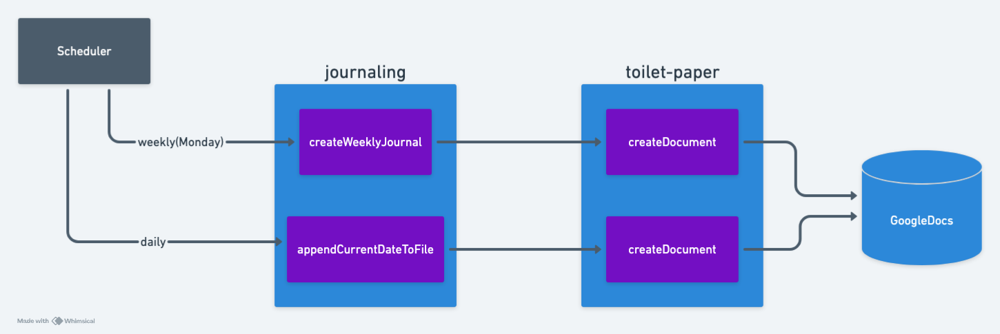

## Journaling System

A [Google Apps Script](https://github.com/gardusig/journaling) designed to automate the creation and management of journaling documents in Google Drive. The script automatically creates a new document for each week, organizes it into weekly folders, and appends the current date as a heading. This automation simplifies the process of maintaining a daily or weekly journal.

## ToiletPaper Library

A custom [Google Apps Script library](https://github.com/gardusig/toilet-paper) providing utility functions for document and folder management. The library handles the creation, duplication prevention, and content management of Google Docs. It provides a playful, user-friendly interface through its namespace `ToiletPaper.Tissuer`, enabling seamless integration with the journaling system.